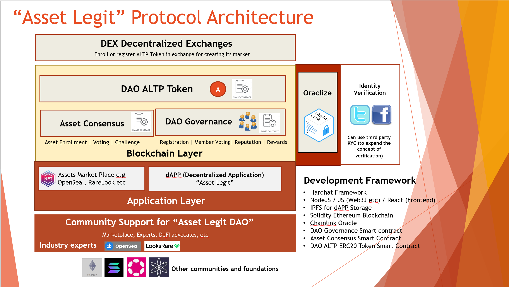
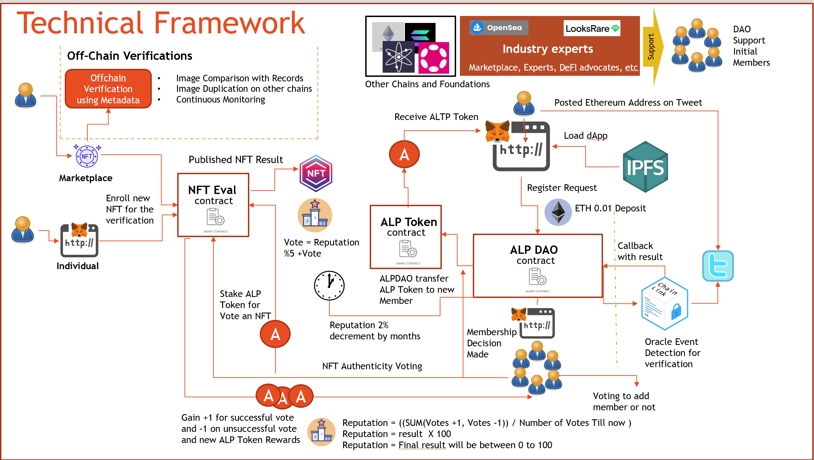

# NFTLegitimateDAOProtocol
This is a legitimate DAO Protocol for NFT 
## **Decentralized Assets and NFT Legitimacy Protocol **

#### **Project Detail**

**Problem in the Decentralized World :** In the realm of digital environments, assessing the authenticity and acceptability of an asset within a thriving and expansive community proves to be a challenging task, even with comprehensive information at hand. In fact, accomplishing this task becomes nearly unattainable in the absence of such information.

**Solution is DAO Decentralized Autonomous Organization Protocol:**
 
1) Implementation of a protocol that engages an open community can address the challenges of evaluating asset quality in a digital environment.
2) The protocol establishes a trustworthy and reliable mechanism for determining the acceptability of public assets.
3) The evaluation process is driven by a community with distributed voting power.
4) An adaptive identity validation process ensures effective oversight and moderation.
5) This approach offers a scalable solution to content moderation as the digital asset landscape expands and evolves.
6) The involvement of a self-regulated community plays a crucial role in resolving the problem.
7) The community actively decides on membership, including adding or removing individuals.
8) Consensus is reached within the community through voting to evaluate asset authenticity.
9) Each community member has the opportunity to vote on the legitimacy of an asset. 

## ** “Asset Legit” Protocol Details! **

We named our protocol “Asset Legit protocol”. In order to achieve this protocol following needs to be addressed. 

**1. DAO Creation**
A DAO must be created by the community renowned members like Ethereum Foundation, OpenSea, and others. 

Each Chain must represent its own DAO Creation with respect to a Smart Contract. For instance, Ethereum based contract will cover only Ethereum based assets. (Currently we chose Ethereum)

**2. Asset Legit Protocol ALPT Token**
The ALPT token will be created to incentivize the members.

A separate smart contract must be created with lazy minting.

These tokens should be allowed to trade as an asset.

**3. Members Registration and Verification:**
  
To register, a user needs to deposit a membership fee.

Additionally, every user must declare their social identity.

The new joiner must call a verification transaction to DAO with Fee

Joiner shares his social media post with his EOA address.  

The DAO contract will call Chainlink oracle to verify EOA Address

If the Post address matches the joiner’s address he is in. 

Last part is voting by DAO members on the arrival of a new member.

Higher votes allowed the new user to become DAO member.

New joiners will get an initial reputation of 12 points.  

New joiner will get ALPT Tokens against his paid Fees.

**4. Asset Enrollment: **
 
A separate contract must be used for this purpose. 

Anyone can submit an Asset for its audit. 

Asset ID and Contract address must be provided for evaluation.

**5. Asset Voting Consensus :**

The DAO Members can only vote for the asset, not anyone else.

Every member must deposit ALPT tokens to vote for any new asset.

Every Vote will be weighted with respect to the voter’s reputation.

Voting only targets if the asset “is fake” or “is authentic”.

Voting should have the criteria of time limit for each asset

Members with the higher votes on the “is fake” or “is authentic” will get 
1.  Reputation points 
2.  ALPT tokens as incentives 

**6. Reputation Management:**

Every DAO Member’s reputation will get increased by voting.

Reputation points will increase based on his current reputation weight.

Every month, 2% of each member’s reputation will decrease.

**7. Asset or Member Dispute Management:  **

Any public user can initiate a dispute on the Asset by paying a fee.

New disputes can create new voting by DAO Members

DAO Members can initiate votes against each other to remove bad actors

Reputation will get effected on bad vote and choices 

## **Further Optimization Requirement **

